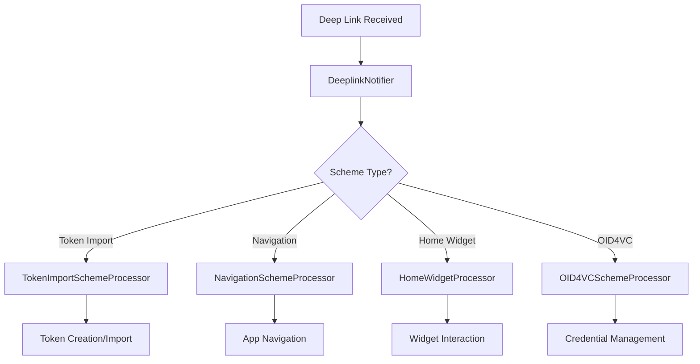

# Deep Linking in privacyIDEA Authenticator

## Overview

The privacyIDEA Authenticator supports comprehensive deep linking capabilities that enable seamless integration with external applications, credential issuers, and verification services. This document outlines the supported URL schemes, implementation details, and real-world use cases.

## Supported URL Schemes

### Traditional Token Import Schemes

| Scheme                 | Purpose                                           | Example                                                                          |
| ---------------------- | ------------------------------------------------- | -------------------------------------------------------------------------------- |
| `otpauth://`           | Standard OTP authentication URLs (RFC 6238)       | `otpauth://totp/Example:alice@google.com?secret=JBSWY3DPEHPK3PXP&issuer=Example` |
| `otpauth-migration://` | Google Authenticator migration format             | `otpauth-migration://offline?data=<encoded_migration_data>`                      |
| `pia://`               | privacyIDEA-specific token imports and QR backups | `pia://totp/service?secret=MYSECRET&issuer=MyService`                            |

### Navigation Schemes

| Scheme                  | Purpose                           | Example                                  |
| ----------------------- | --------------------------------- | ---------------------------------------- |
| `homewidgetnavigate://` | Navigate from home screen widgets | `homewidgetnavigate://link?id=widget123` |

### OID4VC (OpenID for Verifiable Credentials) Schemes

| Scheme                       | Purpose                          | Example                                                             |
| ---------------------------- | -------------------------------- | ------------------------------------------------------------------- |
| `openid-credential-offer://` | Credential issuance offers       | `openid-credential-offer://?credential_offer=<encoded_offer>`       |
| `openid4vp://`               | Verifiable presentation requests | `openid4vp://?request=<presentation_request>&callback=<return_url>` |
| `openid-credential://`       | Direct credential imports        | `openid-credential://?credential=<encoded_credential>`              |

## Architecture

### Deep Link Processing Pipeline



### Key Components

- **DeeplinkNotifier**: Central deep link coordinator using app_links package
- **Scheme Processors**: Handle specific URL scheme types
- **Deep Link Listeners**: React to deep link events and update app state
- **Platform Integration**: Native Android/iOS URL scheme registration

## OID4VC Authentication Flow via Deep Linking

### Overview

OID4VC presentation requests via deep linking enable **passwordless authentication** where users log into services using verifiable credentials instead of traditional passwords. This represents a fundamental shift from "something you know" (passwords) to "something you have + something you are" (verifiable credentials + biometrics).

### Authentication Flow Comparison

#### Traditional Password Login

```
1. User navigates to website
2. Enters username/password
3. May enter 2FA code
4. Logged into service
```

#### OID4VC Deep Link Authentication

```
1. User navigates to website
2. Website triggers: openid4vp://?presentation_definition=<identity_request>
3. Authenticator app opens automatically
4. App displays: "Website wants to verify your [identity/credentials]"
5. User approves with biometric authentication
6. App sends verifiable credentials back to website
7. User logged in - NO passwords needed!
```

### Real-World Authentication Examples

#### Government Portal Login

```
// Deep link for government service authentication
openid4vp://?
  presentation_definition={
    "input_descriptors": [{
      "id": "government_id",
      "name": "Government Issued ID",
      "constraints": {
        "fields": [{"path": ["$.credentialSubject.government_id"]}]
      }
    }]
  }&
  client_id=gov.state.portal&
  callback=https://portal.gov.state/login/callback
```

#### University Portal Login

```
// Deep link for student portal authentication
openid4vp://?
  presentation_definition={
    "input_descriptors": [{
      "id": "student_id",
      "name": "Student Credentials",
      "constraints": {
        "fields": [{"path": ["$.credentialSubject.student_id"]}]
      }
    }]
  }&
  client_id=university.edu&
  callback=https://portal.university.edu/auth/return
```

#### Corporate System Login

```
// Deep link for employee authentication
openid4vp://?
  presentation_definition={
    "input_descriptors": [{
      "id": "employee_badge",
      "name": "Employee Credentials",
      "constraints": {
        "fields": [
          {"path": ["$.credentialSubject.employee_id"]},
          {"path": ["$.credentialSubject.clearance_level"]}
        ]
      }
    }]
  }&
  client_id=corp.company.com&
  callback=https://intranet.company.com/sso/callback
```

### Authentication Benefits

#### Security Advantages

- ✅ **No passwords to steal** - credentials are cryptographically verifiable
- ✅ **Anti-phishing protection** - credentials contain proof of issuer authenticity
- ✅ **Selective disclosure** - share only necessary information
- ✅ **Cryptographic proof** - mathematically verifiable identity
- ✅ **Device-bound security** - leverages biometric authentication

#### User Experience Benefits

- ✅ **One-click authentication** - no typing usernames/passwords
- ✅ **Cross-platform compatibility** - same credentials work everywhere
- ✅ **Privacy-preserving** - control exactly what information is shared
- ✅ **Seamless flow** - direct app-to-app communication
- ✅ **Reduced friction** - eliminates password reset workflows

### Implementation in Authenticator App

```dart
Future<void> _handlePresentationRequest(Uri uri, bool fromInit) async {
  // Parse presentation request from deep link
  final presentationDef = uri.queryParameters['presentation_definition'];
  final clientId = uri.queryParameters['client_id'];
  final callback = uri.queryParameters['callback'];

  // Show user what credentials are being requested
  final approved = await _showPresentationDialog(
    requester: clientId,
    requestedCredentials: presentationDef,
  );

  if (approved) {
    // Require biometric authentication for security
    final authenticated = await lockAuth(
      reason: (l) => l.authToAcceptPresentationRequest,
      localization: context.localizations,
    );

    if (authenticated) {
      // Create verifiable presentation
      final presentation = await _createPresentation(presentationDef);

      // Return credentials to requesting service
      await _sendPresentationResponse(callback, presentation);

      // User is now authenticated/logged into the service!
      _showSuccessMessage("Successfully authenticated with $clientId");
    }
  }
}
```

## Use Cases

### 1. Enterprise Identity Management

#### Scenario: Employee Onboarding

**Flow:**

1. New employee completes HR onboarding process
2. Identity management system generates credential offer
3. Employee receives deep link via email/SMS: `openid-credential-offer://?credential_offer=<employee_badge>`
4. Link opens authenticator app automatically
5. Employee reviews and accepts corporate identity credential
6. Credential stored in app for future use

**Benefits:**

- Streamlined onboarding process
- No manual credential setup
- Immediate access to corporate resources
- Reduced IT support overhead

#### Scenario: Access Control Integration

**Flow:**

1. Employee approaches secure building entrance
2. Card reader displays QR code with presentation request
3. Employee scans QR containing: `openid4vp://?request=<access_request>`
4. App opens and shows required credentials (employee badge, clearance level)
5. Employee authorizes credential sharing
6. Building access granted based on verified credentials

### 2. Government Digital Identity

#### Scenario: Digital Driver's License Issuance

**Flow:**

1. Citizen completes online DMV renewal
2. Identity verification completed through existing channels
3. DMV system generates: `openid-credential-offer://?credential_offer=<drivers_license>`
4. Deep link sent via secure government portal
5. Citizen's mobile wallet receives verifiable driver's license
6. License immediately usable for age verification, TSA, etc.

**Benefits:**

- Instant credential issuance
- Reduced physical document dependency
- Enhanced security through cryptographic verification
- Interoperability with other government services

#### Scenario: Voting Credential Verification

**Flow:**

1. Polling station requests voter verification
2. Voter receives: `openid4vp://?request=<voter_eligibility_request>`
3. App displays available voting credentials
4. Voter authorizes sharing of eligibility proof
5. Polling system verifies credential authenticity
6. Voter cleared for ballot access

### 3. Healthcare Credential Management

#### Scenario: Vaccination Credential Issuance

**Flow:**

1. Patient receives vaccination at healthcare provider
2. Provider's system generates verifiable health credential
3. Patient receives: `openid-credential-offer://?credential_offer=<vaccination_record>`
4. Health credential automatically added to patient's wallet
5. Credential available for travel, workplace verification, etc.

**Benefits:**

- Tamper-proof health records
- Privacy-preserving selective disclosure
- Instant verification without paper documents
- Cross-border health credential recognition

#### Scenario: Medical Professional Licensing

**Flow:**

1. Healthcare professional completes licensing renewal
2. Medical board issues digital license credential
3. Professional receives: `openid-credential-offer://?credential_offer=<medical_license>`
4. Digital license stored in professional's wallet
5. Hospitals can instantly verify credentials during hiring

### 4. Educational Credentials

#### Scenario: Digital Diploma Issuance

**Flow:**

1. Student completes degree requirements
2. University generates verifiable diploma credential
3. Graduate receives: `openid-credential-offer://?credential_offer=<diploma>`
4. Digital diploma stored in graduate's wallet
5. Employers can instantly verify education credentials

**Benefits:**

- Prevents diploma fraud
- Instant credential verification for employers
- Lifelong access to educational credentials
- Global recognition and portability

#### Scenario: Professional Certification

**Flow:**

1. Professional completes certification program
2. Certification body issues digital certificate
3. Professional receives credential via deep link
4. Certificate used for job applications, consulting engagements
5. Clients can verify professional qualifications instantly

### 5. Financial Services

#### Scenario: KYC (Know Your Customer) Credentials

**Flow:**

1. Customer completes bank KYC process
2. Bank issues identity verification credential
3. Customer receives: `openid-credential-offer://?credential_offer=<kyc_credential>`
4. Credential stored in customer's wallet
5. Other financial services can verify identity without re-doing KYC

**Benefits:**

- Reduced customer onboarding friction
- Lower compliance costs for financial institutions
- Enhanced privacy through selective disclosure
- Standardized identity verification across institutions

#### Scenario: Credit Score Verification

**Flow:**

1. Credit agency issues verifiable credit score credential
2. Consumer receives credential via deep link
3. When applying for loans, lender requests: `openid4vp://?request=<credit_verification>`
4. Consumer authorizes sharing of credit credential
5. Instant credit verification without traditional credit pulls

### 6. Supply Chain and Manufacturing

#### Scenario: Product Authenticity Verification

**Flow:**

1. Manufacturer embeds deep link QR code on product
2. Consumer scans QR containing: `openid4vp://?request=<authenticity_request>`
3. If product credentials are in consumer's wallet, verification proceeds
4. Product authenticity confirmed through cryptographic proof
5. Consumer confident in product genuineness

#### Scenario: Professional Certification for Workers

**Flow:**

1. Worker completes safety/skills training
2. Training organization issues: `openid-credential-offer://?credential_offer=<certification>`
3. Worker's credentials available for worksite verification
4. Employers can instantly verify worker qualifications
5. Enhanced workplace safety through verified competencies

## Technical Implementation

### Platform Registration

#### Android (AndroidManifest.xml)

```xml
<intent-filter>
    <action android:name="android.intent.action.VIEW" />
    <category android:name="android.intent.category.DEFAULT" />
    <category android:name="android.intent.category.BROWSABLE" />
    <!-- Traditional schemes -->
    <data android:scheme="otpauth" />
    <data android:scheme="otpauth-migration" />
    <data android:scheme="pia" />
    <!-- OID4VC schemes -->
    <data android:scheme="openid-credential-offer" />
    <data android:scheme="openid4vp" />
    <data android:scheme="openid-credential" />
</intent-filter>
```

#### iOS (Info.plist)

```xml
<key>CFBundleURLSchemes</key>
<array>
    <string>otpauth</string>
    <string>otpauth-migration</string>
    <string>pia</string>
    <string>openid-credential-offer</string>
    <string>openid4vp</string>
    <string>openid-credential</string>
</array>
```

### Deep Link Processing

#### Credential Offer Processing

```dart
Future<List<ProcessorResult<Token>>?> _handleCredentialOffer(
  Uri uri,
  bool fromInit,
) async {
  final client = OID4VCClient(baseUrl: 'https://issuer.example.com');
  final offer = await client.parseCredentialOffer(uri.toString());

  if (offer == null) {
    return [ProcessorResult.failed(
      (l) => l.invalidLink('OID4VC Credential Offer'),
      resultHandlerType: resultHandlerType,
    )];
  }

  // Process credential offer and create appropriate token
  final token = await _createTokenFromOffer(offer);
  return [ProcessorResult.success(token, resultHandlerType: resultHandlerType)];
}
```

#### Presentation Request Processing

```dart
Future<List<ProcessorResult<Token>>?> _handlePresentationRequest(
  Uri uri,
  bool fromInit,
) async {
  final requestParam = uri.queryParameters['request'];
  if (requestParam == null) return null;

  // Decode and process presentation request
  final request = await _decodePresentationRequest(requestParam);

  // Trigger credential selection UI
  await _showCredentialSelectionDialog(request);

  return []; // No tokens created, just UI interaction
}
```

## Security Considerations

### URL Validation

- All deep links are validated against registered schemes
- Malformed URLs are rejected with appropriate error messages
- Cryptographic verification for credential-related deep links

### Privacy Protection

- Credential offers processed locally without external data leakage
- Presentation requests allow selective disclosure
- User consent required for all credential sharing operations

### Anti-Phishing Measures

- App-to-app communication reduces manual URL entry
- Scheme validation prevents malicious redirects
- Visual indicators for verified credential issuers

## Integration Guidelines

### For Credential Issuers

1. **Generate Compliant URLs**: Use standard OID4VC credential offer format
2. **Secure Delivery**: Send deep links through authenticated channels
3. **Handle Timeouts**: Implement appropriate expiration for offers
4. **Error Handling**: Provide fallback mechanisms for unsupported devices

### For Verifiers

1. **Standard Requests**: Use OID4VP presentation request format
2. **Clear Requirements**: Specify exactly which credentials are needed
3. **Callback Handling**: Implement proper return URL handling
4. **Graceful Degradation**: Support alternative verification methods

### For Developers

1. **Test All Schemes**: Verify deep link handling across platforms
2. **Error Scenarios**: Test malformed URLs and edge cases
3. **User Experience**: Ensure smooth transitions between apps
4. **Performance**: Optimize deep link processing for responsiveness

## Future Enhancements

### Planned Features

- **Batch Credential Offers**: Support multiple credentials in single deep link
- **Conditional Issuance**: Credentials issued based on presentation of other credentials
- **Cross-Chain Verification**: Support for blockchain-based credential verification
- **Biometric Binding**: Link credentials to device biometric authentication

### Standards Compliance

- Full OID4VC specification compliance
- W3C Verifiable Credentials support
- ISO 18013-5 mDoc integration
- IETF standards adherence

## Conclusion

Deep linking transforms the privacyIDEA Authenticator from a traditional OTP app into a comprehensive digital identity wallet. By supporting standard protocols like OID4VC, the app enables seamless credential workflows across industries, improving user experience while maintaining strong security and privacy protections.

The implementation provides immediate benefits for organizations looking to modernize their identity infrastructure while remaining compatible with existing authentication systems. As digital identity standards continue to evolve, the deep linking architecture ensures the app can adapt to new use cases and technologies.
